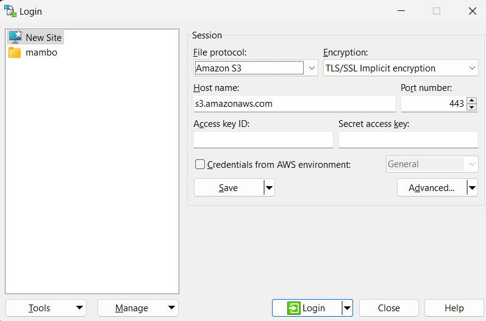
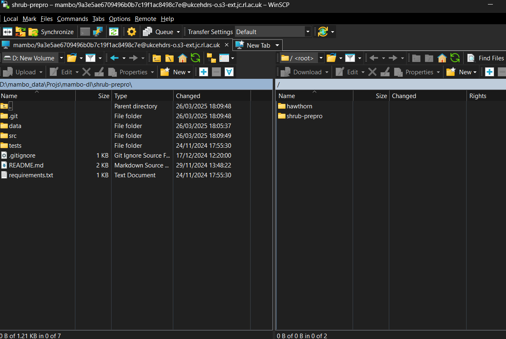
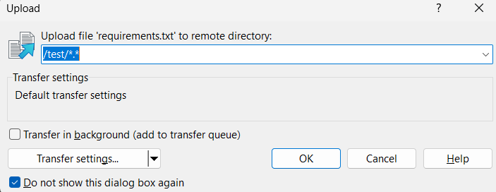

# s3 object storage on JASMIN

Aim: publish our data in a cloud service where it can be re-used without making local copies, be searchable through a catalogue, and have changes tracked in source control.

## Storage location 

Our JASMIN Group Workspace provides storage for drone-based projects including MAMBO and AgZero+. It's "short-term", years rather than decades. UKCEH does have medium-term plans to host its own object storage in-house.

`s3` is a de facto standard originally from Amazon Web Services. Documentation for tools describes use with AWS, but it's usable with JASMIN object storage just the same.

[s3 portal](https://s3-portal.jasmin.ac.uk/) shows you which object stores you have got access to. Within each store you can create _keys_ for authenticating when uploading new data. There are two keys, an `access key` which is always shown, and a `secret key` which you only get to see once.

## Tools for uploading data

### s3cmd

`[s3cmd](https://github.com/s3tools/s3cmd)` is a python-based commandline tool for interacting with s3 storage.

Install via pip:

`pip install s3cmd`

Create a `.s3cfg` file with credentials. This should live _in your home directory_, not your project directory. It looks like this, with the values in square brackets replaced by the keys you get from the [s3 portal](https://s3-portal.jasmin.ac.uk/)

```
access_key = [access key] 
host_base = [store name].s3-ext.jc.rl.ac.uk
host_bucket = [store_name].s3-ext.jc.rl.ac.uk
secret_key = [secret key] 
use_https = True
signature_v2 = False 
```

### List buckets

`s3cmd ls`

### Make a bucket

A bucket is a collection of data. 

`s3cmd mb s3://hawthorn`

This should now show a new bucket in the JASMIN s3 portal. There doesn't seem to be a web interface to create them.

### Add files

Add a single file: 

`s3cmd put test.txt s3://shrub-prepro/test.txt`

Add a directory, recursively. This example copies the `data` directory to a bucket named `shrub-prepro`.

It runs like `rsync`, e.g. repeated runs will only copy missing files. Use a `--dry-run` switch to see hat will happen without invoking the copy.

`s3cmd sync --verbose data/ s3://shrub-prepro/`


## WinSCP

If you prefer a graphical interface, or if you're in a locked-down Windows environment and can't install python libraries, WinSCP is available through the "Software Center" and supports file transfer to s3 with the same interface used for (S)FTP.

### Connect to an s3 storage container

Use "Amazon S3" as the _File protocol_ when starting a new session in WinSCP. Keep "TLS/SSL Implicit encryption" selected. The Access key and Secret key are the ones you obtain from the [JASMIN s3 portal](https://s3-portal.jasmin.ac.uk/). The hostname should be `s3-ext.jc.rl.ac.uk` - note the extra `-ext` suffix, for access outwith the JASMIN infrastructure.



Navigate on the left hand side to your data storage (e.g. external drive in this case) and on the right to your storage destination in s3 



We can use "New Folder" to create new buckets if needed, and drag-and-drop functionality to copy data across and it works as expected, treating s3 as it would a filesystem.



### Verify it has worked

Back at the commandline we can show all buckets, and list the context of a bucket, and see this has worked, hooray:

```
(.venv) (base) [jowals@wlsc-lin56 shrub-prepro]$ s3cmd ls
2025-04-02 08:46  s3://hawthorn
2025-04-10 08:41  s3://shrub-prepro
2025-04-15 12:06  s3://test
(.venv) (base) [jowals@wlsc-lin56 shrub-prepro]$ s3cmd ls s3://test
2025-04-15 12:07           40  s3://test/requirements.txt
```


